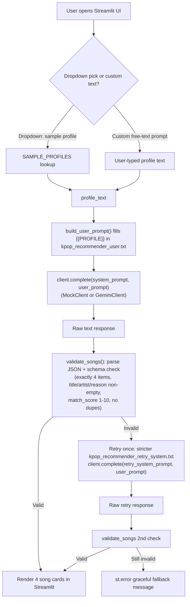

# 🎵 Gemini K-pop Recommender (Final Project Extension)

## About This Extension

This extends an already-submitted assignment: the **Music Recommender Simulation** (CodePath AI110,
Module 3, documented in [`README.md`](README.md)). That original submission is a command-line,
content-based recommender (`src/main.py` + `src/recommender.py`) that scores a fixed 18-song mock
catalog (`data/songs.csv`) against a hardcoded taste profile (favorite genre, favorite mood, target
energy) and prints a ranked top-k list with a per-song explanation. It has no UI, no external API
calls, and no real-world song data — everything it recommends comes from that small mock CSV.

My issue with the original project is that I wasn't getting back real songs that I can actually look up to listen to later. I've always wanted to make a small feature of sending a text prompt to an LLM and render back its response, which is why I was so glad we worked on the Tinker Lab for week 9: BugHound. I personalized this project to be a K-pop recommender, targetted at both veteran and first-timers, to give them a curated list of songs to potentially add to their playlist!

This is run with a Streamlit UI (`streamlit_app.py`) backed by the **Gemini API** that
recommends **real** K-pop songs (not the mock catalog) based on a sample taste profile or a
free-text description, with a structured-prompting + output-validation/retry reliability layer.

**This feature does not share any code, data, or scoring logic with the original recommender.** It
doesn't call `score_song`, doesn't read `songs.csv`, and doesn't use the genre/mood/energy formula
at all. Your profile text goes straight into a prompt sent to Gemini; Gemini itself decides which
real songs fit and self-reports a `match_score` (1-10) and a `reason` for each pick — that score is
Gemini's own judgment, not a number our code computes. The only logic on our side is a guardrail
(`validate_songs()`) that checks the response is well-formed before showing it to you; it doesn't
rank or score anything itself. The original CLI recommender (`src/main.py`, `src/recommender.py`,
`tests/test_recommender.py`) is completely untouched by this extension.

Key files: `kpop_agent.py` (prompt building + validation/retry logic), `llm_client.py`
(`GeminiClient`/`MockClient`), `prompts/*.txt` (prompt templates), `streamlit_app.py` (UI),
`tests/test_kpop_agent.py` (guardrail tests), `docs/architecture.mmd` (architecture diagram).

---

## Getting Started

### Setup

1. Install dependencies (same `requirements.txt` as the base project, now includes
   `python-dotenv` and `google-genai`):

   ```bash
   pip install -r requirements.txt
   ```

2. Copy the env template and add your Gemini API key:

   ```bash
   cp .env.example .env
   # then edit .env and set GEMINI_API_KEY=your_real_key
   ```

   Get a free key at [aistudio.google.com/apikey](https://aistudio.google.com/apikey).

3. Run the Gemini-powered K-pop recommender UI:

   ```bash
   streamlit run streamlit_app.py
   ```

   Note: `streamlit run src/main.py` does **not** work — `src/main.py` is a plain CLI script with no
   Streamlit calls in it. The Streamlit UI lives in `streamlit_app.py` at the project root.

### Running Tests

```bash
pytest tests/test_kpop_agent.py
```

These tests use fake in-memory clients and make **no live network calls**, so they always pass
without an API key. (Running plain `pytest` from the project root also runs the base project's
`tests/test_recommender.py` alongside these.)

---

## AI-Powered Real Song Recommendations (Gemini)

- Pick a sample profile (K-pop rock, K-pop pop, K-pop ballad, K-pop hip-hop, K-pop retro/nostalgic)
  **or** choose `(custom)` and describe what you want in your own words.
- Your profile text is inserted into a prompt template and sent to Gemini via `llm_client.py`.
- Gemini is instructed to return only a JSON array of exactly 4 objects, each with `title`,
  `artist`, a one-sentence `reason` explaining why the song fits your profile, and a `match_score`
  (1-10) representing how strong that fit is.
- The response is validated and rendered as 4 song cards (title, artist, match score, reason). See
  the reliability section below for what happens when Gemini's response doesn't match that format.

### Temperature: Controlling Variety vs. Consistency

The sidebar's temperature slider (passed through to Gemini via
`types.GenerateContentConfig(temperature=...)` in `llm_client.py`) controls how much randomness
Gemini uses when picking songs.

At each step of generating a response, the model has a probability distribution over what could
come next (which song, which artist, which phrasing). Temperature reshapes that distribution
before a choice is sampled from it:

- **Low temperature (near 0)**: the distribution is sharpened so the single most-likely option
  dominates almost completely. The model keeps returning the same "safe," statistically obvious
  answer for a given prompt — e.g. the same iconic song every time you ask for the same profile.
- **High temperature (closer to 1-2, depending on what the model allows)**: the distribution
  flattens out, so less-dominant-but-still-plausible options get a real chance of being picked.
  Repeated identical prompts return more varied results.

This is a real tradeoff for this app specifically: since the reliability guardrail
(`validate_songs()`, below) requires strict, well-formed JSON with real songs, pushing temperature
too high increases the odds of a malformed or slightly-off response, which triggers more retries
and more chances of hitting the guardrail's failure path. This project defaults the slider around
**0.4-0.9**, which is a reasonable middle ground — varied results without breaking the schema too
often.

### Architecture



The same diagram lives as a standalone Mermaid source file at [`docs/architecture.mmd`](docs/architecture.mmd).

### Reliability: Output Validation + Retry

Gemini doesn't always follow formatting instructions perfectly, so every response is validated
against a strict schema before it's shown to the user: it must parse as JSON, contain exactly 4
objects, each with non-empty `title`/`artist`/`reason` strings and a `match_score` integer between
1 and 10, with no duplicate songs. If validation fails, the agent retries **once** with a stricter,
more explicit system prompt. If it still fails, the UI shows a graceful error instead of garbage
output. This logic lives in `kpop_agent.py` (`validate_songs`, `get_recommendations`) and is
exercised deterministically (no live API calls) in `tests/test_kpop_agent.py` using fake clients.

**Example 1 — valid response on the first attempt**

- Input: profile = `"energetic k-pop"`, client returns valid JSON immediately.
- Behavior: `validate_songs()` parses 4 well-formed, distinct songs on attempt 1; no retry needed.
- Result: `{"status": "ok", "attempts": 1, "songs": [...4 songs...]}` — song cards render immediately.

**Example 2 — malformed first response, retry succeeds**

- Input: same profile, but the client's first reply is `"Sure, here are some songs: Dynamite by BTS..."` (prose, not JSON).
- Behavior: `validate_songs()` fails attempt 1 (`"Response was not a parseable JSON array."`). The agent
  retries with `prompts/kpop_recommender_retry_system.txt`, and the second response is valid JSON.
- Result: `{"status": "ok", "attempts": 2, "songs": [...4 songs...]}` — the UI shows an info banner
  ("First response didn't match the expected format — retried once...") then the song cards.

**Example 3 — invalid after the retry too**

- Input: same profile, but the client always returns `"not json at all"`.
- Behavior: both attempt 1 and attempt 2 fail `validate_songs()` (`"Response was not a parseable JSON array."`).
- Result: `{"status": "failed", "attempts": 2, "songs": []}` — the UI shows
  `st.error("Gemini couldn't produce a valid 4-song list after a retry: ...")` instead of crashing
  or showing malformed data.

Run `pytest tests/test_kpop_agent.py -v` to see all three scenarios (plus schema-edge-case tests
for duplicates, wrong song counts, missing reasons, and out-of-range match scores) pass
deterministically.

---

## Sample Outputs

Command: `streamlit run streamlit_app.py`, mode = "Gemini (requires API key)".

**Dropdown example** — profile = "K-pop ballad" (actual output, `gemini-flash-lite-latest`, temperature 0.9):

```
1. 🎵 Through the Night — IU
   Match score: 10/10
   A delicate and timeless acoustic ballad that highlights IU's soothing vocals.

2. 🎵 Starting Over — Gaho
   Match score: 8/10
   An uplifting, emotional ballad with powerful vocals built around a driving acoustic guitar.

3. 🎵 Breathe — Lee Hi
   Match score: 9/10
   A deeply comforting piano ballad written by Jonghyun that offers solace to anyone feeling tired.

4. 🎵 To You My Light — Maktub
   Match score: 8/10
   A soaring, melodious indie-ballad featuring rich emotional delivery and sweeping orchestration.
```

**Custom text example** — profile = "moody, cinematic K-pop with orchestral strings and a slow build" (actual output):

```
1. 🎵 Monster — Red Velvet - Irene & Seulgi
   Match score: 9/10
   It features dramatic, tension-building string arrangements and a hauntingly dark atmosphere.

2. 🎵 Hala Hala (Hearts Awakened, Live Alive) — ATEEZ
   Match score: 8/10
   The theatrical intensity and grand orchestral elements create a massive, cinematic buildup.

3. 🎵 Boca — Dreamcatcher
   Match score: 9/10
   It blends driving rock instrumentation with soaring orchestral string melodies for a dramatic effect.

4. 🎵 Kingdom Come — The Boyz
   Match score: 8/10
   This track delivers a regal, brooding soundscape backed by sweeping cinematic strings.
```

**Dropdown example** — profile = "K-pop hip-hop" (actual output, temperature 0.8):

```
1. 🎵 Maniac — Stray Kids
   Match score: 10/10
   Features a heavy industrial beat and aggressive rap verses that match the requested intense hip-hop energy.

2. 🎵 Daechwita — Agust D
   Match score: 10/10
   Combines traditional Korean instrumentation with a booming trap beat and relentless, fierce rapping.

3. 🎵 GOTTASADAE — BewhY
   Match score: 9/10
   Driven by a massive, hard-hitting brass and bass production combined with lightning-fast technical rap delivery.

4. 🎵 MIC Drop (Steve Aoki Remix) — BTS
   Match score: 9/10
   Delivers a heavy bassline and swaggering hip-hop verses designed for maximum impact.
```
Walkthrough Gif: 


(Note: asking the same profile again may return a different mix of songs — this is expected, see
["Temperature: Controlling Variety vs. Consistency"](#temperature-controlling-variety-vs-consistency) above.)

**Edge case — empty custom input**: clicking "Get Recommendations" with the custom text field left
blank shows `st.warning("Enter a profile description or choose a sample profile first.")` and does
not call Gemini at all (avoids wasting an API call on empty input).

---

## AI Collaboration Reflection

I wanted to expand on the Music Recommender Project, which was explicitly CLI. Before we started the coding work, I gave a prompt of the list of ideas I wanted to add when we run this project in streamlit. I said that my main goal for this feature was to have a prompt that we send to an LLM and it should give back a response with real kpop songs. It was here that Claude asked more clarifying questions, and recommended potential useful features that we add when we render the response. It was great going back and forth with the ideas and eventually narrowed down the features it recommended to just 2 things that we implement in this project: An overall match score (out of 10) the song has to our prompt, and a small description as to why this song was recommended to us based on the prompt we sent.

When extensively testing this new feature, I noticed that when we were submitting the same profile more than once consecutively, the #1 song, would not change. This was probably caused by two things. The first possibility was the temperature bar was not working properly. The point of this is to introduce more randomness to the result, where a temperature closer to 0 would be more strict with its song rankings, while closer to 1 would introduce more variety. We fixed this bug by sending over this temperature param along with the Gemini prompt (the bar was just there and it didn't do anything whoops!). Another layer to this fix was to improve on the prompt that we were sending to Gemini. Now we explicitly say: "Do not just default to the single most famous/iconic song for the profile every time. Vary your picks across requests while staying accurate, and include at least one song that isn't the most obvious mainstream choice."

This feature is highly dependent on Gemini's current training data. From my perspective, the songs it recommends seem dated, maybe 3 or so years old, not to say that these older songs aren't as good as the newer released kpop songs. We just miss out on more recent releases to give as recommendations. There might be more improvements to be made within our validation, where at the moment it runs only once with more stricter guidelines to follow if the first response didn't suffice what we were looking for. To be more efficient with my free calls, I strictly only used gemini-flash-lite-latest. If I had access to more tokens I would test out the results for the more higher models with varying effort levels. But for now, this feature was exactly how I pictured it would work! Time to listen to some of the songs that it recommended for me!
